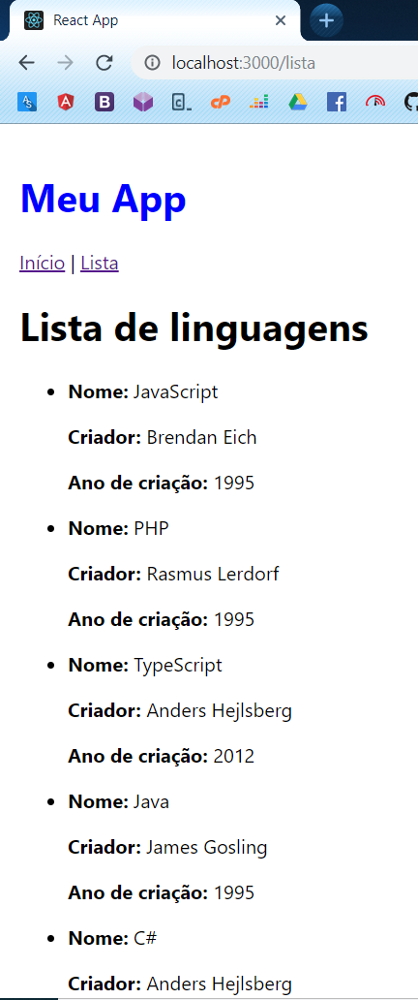
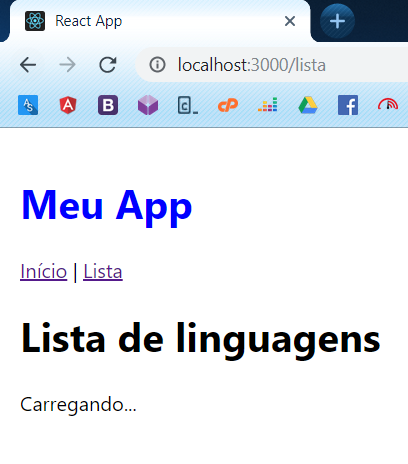

# Consumindo uma API

Consumir e enviar conteúdos para uma API também em algo muito comum em aplicações front-end modernas, pois até agora não utilizamos o back-end para nada.

Vamos consumir uma simples API e exibir utilizando o React, para isso utilizaremos a API do [`fetch`](https://developer.mozilla.org/en-US/docs/Web/API/Fetch_API), que é uma forma nativa do navegador e muito simples para trabalhar com requisições HTTP no JavaScript.

Consumiremos [esta API](http://alefesouza.dev/api/languages.php) com uma lista de linguagens de programação e exibiremos seus conteúdo utilizando JSX.

Lembra que na sessão sobre lifecycles foi dito que o lifecycle/hook `componentDidMount()` era o melhor para isso? Deixe o arquivo **src/List.js** com o código a seguir:

```jsx
import React from 'react';

class List extends React.Component {
    state = {
        linguagens: []
    };

    componentDidMount() {
        fetch('http://alefesouza.dev/api/languages.php')
            .then(res => res.json())
            .then(res => {
                this.setState({
                    linguagens: res
                });
            });
    }

    render() {
        return (
            <div>
                <h1>Lista de linguagens</h1>

                <ul>
                    {this.state.linguagens.map(item => (
                        <li key={item.id}>
                            <p><b>Nome:</b> {item.name}</p>
                            <p><b>Criador:</b> {item.creator}</p>
                            <p><b>Ano de criação:</b> {item.year}</p>
                        </li>
                    ))}
                </ul>
            </div>
        );
    }
}

export default List;
```

No navegador ao clicar em Lista deverá exibir isto:



Como podemos observar, assim que o componente for carregado, fazemos nossa requisição a nossa API e ao receber a resposta do servidor, colocamos ela no state do nosso componente.

Como o React é fortemente baseado na sintaxe padrão JavaScript, não há um `*ngFor` como no Angular ou um `v-for` igual no Vue.js, portanto devemos usar um simples `.map` para iterar sobre o array e exibi-lo diretamente no JSX (sim, isso é a prática mais comum), também devemos ter um identificador único como o ID e utiliza-lo no atributo/props `key` de cada lista que iterarmos, para o React poder identificar claramente qual o item do array representa o elemento renderizado, um exemplo de vantagem nisso é que caso você mude a posição de algum item, o React se preocupa em apenas mover o elemento HTML ao invés de renderizar toda a lista novamente.

Também podemos colocar condicionais e variáveis no nosso JSX para poder ter mensagens de loading por exemplo, coloque o código a seguir no seu **src/List.js**: 

```jsx
import React from 'react';

class List extends React.Component {
    state = {
        linguagens: []
    };

    componentDidMount() {
        fetch('http://alefesouza.dev/api/languages.php')
            .then(res => res.json())
            .then(res => {
                this.setState({
                    linguagens: res
                });
            });
    }

    render() {
        let content = <p>Carregando...</p>

        if (this.state.linguagens.length !== 0) {
            content = (<ul>
                {this.state.linguagens.map(item => (
                    <li key={item.id}>
                        <p><b>Nome:</b> {item.name}</p>
                        <p><b>Criador:</b> {item.creator}</p>
                        <p><b>Ano de criação:</b> {item.year}</p>
                    </li>
                ))}
            </ul>)
        }

        return (
            <div>
                <h1>Lista de linguagens</h1>

                {content}
            </div>
        );
    }
}

export default List;
```

Assim antes de receber a resposta do servidor nosso componente ficará assim:


